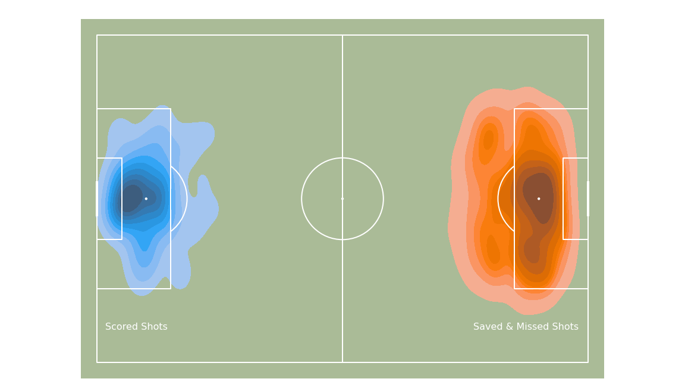
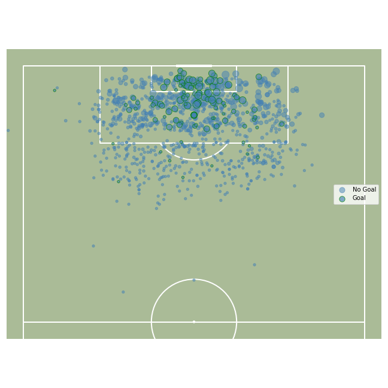

# xG ⚽️
Using data scraped from [SofaScore.com](https://www.SofaScore.com), I calculated xG for each shot taken in the 23/24 Premier League Season using an Artificial Neural Network. 

Using my predicated xG data I have produced a series of visualizations that I will continue to update throughout the season.

## Premier League by xG Differential
[xG Team Table](assets/xG_table.md)

## Top 20 Players by xG
[xG Player Table](assets/xG_player_table.md)

## Shot Location by Outcome

## Outcome & xG by Location

